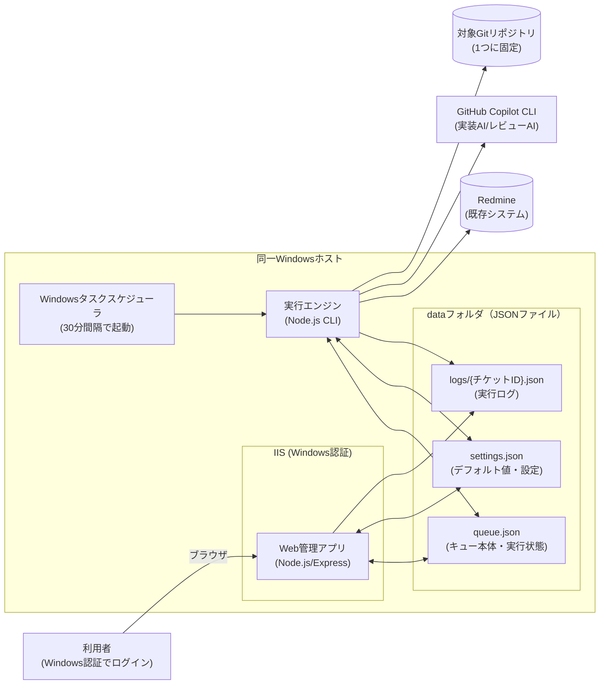

# システム構成図

## 構成図


## コンポーネント一覧
| コンポーネント | 役割 | 技術（提案） |
|---|---|---|
| Web管理アプリ | キュー管理画面。Windows認証でアクセス制御 | Node.js + TypeScript + Express、IIS + iisnodeでホストしIISのWindows認証機能を利用 |
| データ（JSONファイル） | キュー・設定・ログの永続化。DBは使用しない | `queue.json` / `settings.json` / `logs/{チケットID}.json`（詳細は`detailed-design.md`） |
| 実行エンジン | タスクスケジューラから起動されるバッチ処理本体 | Node.js + TypeScript（CLIスクリプト） |
| GitHub Copilot CLI | 実装・レビューを行うAI本体 | child_processで起動、モデルはオプションで指定 |
| Redmine | チケット管理・進捗コメントの記録先（既存システム） | REST API（APIキー認証） |
| 対象Gitリポジトリ | 実装対象。1つに固定 | `simple-git`等でブランチ作成／コミット／プッシュ |
| Windowsタスクスケジューラ | 実行エンジンを一定間隔（初期値30分）で起動するトリガー | OS標準機能 |

Web管理アプリと実行エンジンは別プロセスだが、同一ホスト上の同じJSONファイル群を共有する。同時アクセスによる不整合を防ぐため、ファイル単位のロック（`proper-lockfile`等）を用いる（詳細は`detailed-design.md`の非機能設計を参照）。

## ディレクトリ構成（提案）
```
repo-root/
├── docs/
│   ├── requirements/requirements.md
│   └── design/
│       ├── detailed-design.md   # 全体像・データ設計・連携仕様・未確定事項
│       ├── architecture.md      # 本ファイル：システム構成図
│       ├── sequence.md          # シーケンス図
│       ├── screen-spec.md       # 画面仕様
│       └── api-design.md        # API設計書
├── webapp/            # Web管理アプリ（画面+API）
│   └── src/
├── engine/             # 実行エンジン（タスクスケジューラから起動）
│   └── src/
├── shared/             # JSONファイルアクセス・型定義など共有コード
├── config/
│   └── config.example.json   # Redmine接続情報・対象リポジトリ等の雛形（実値は.gitignore対象）
└── data/
    ├── queue.json
    ├── settings.json
    └── logs/
        └── {チケットID}.json
```
