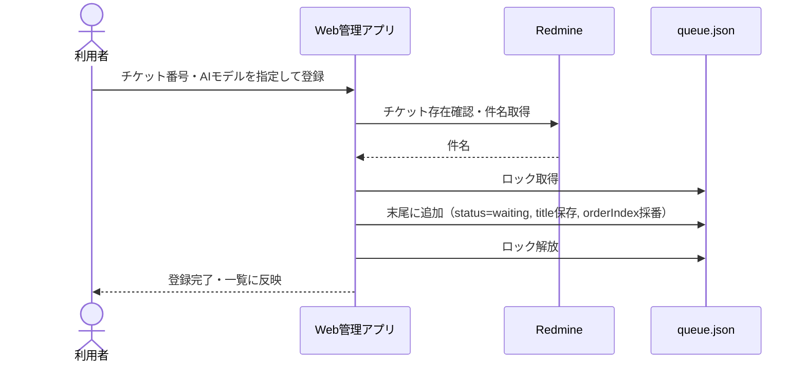
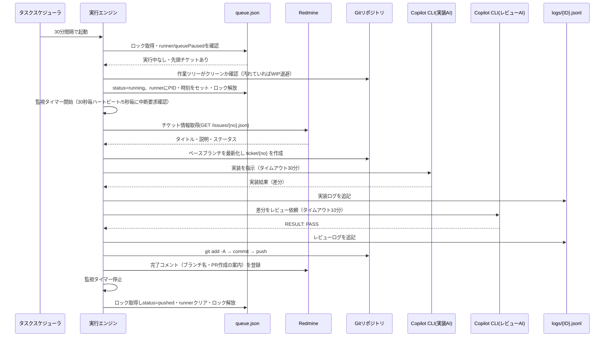
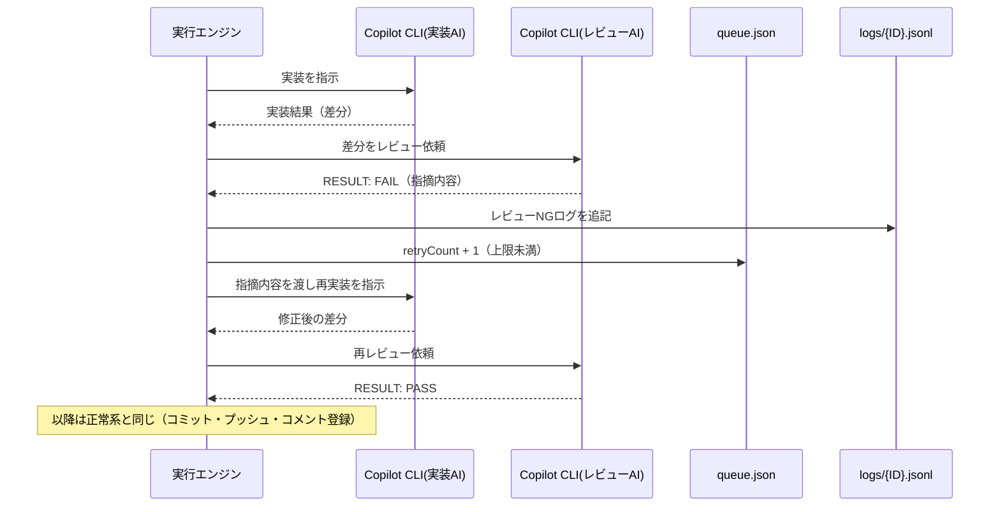
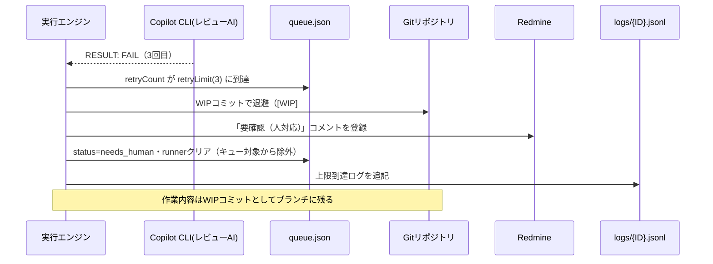
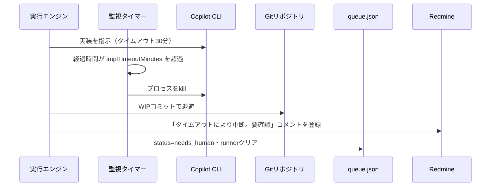
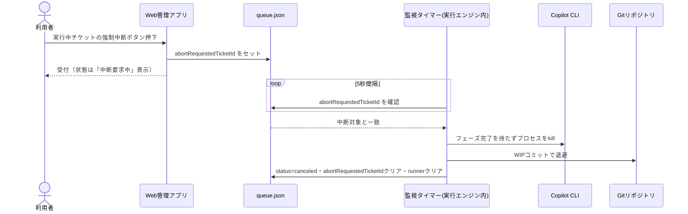
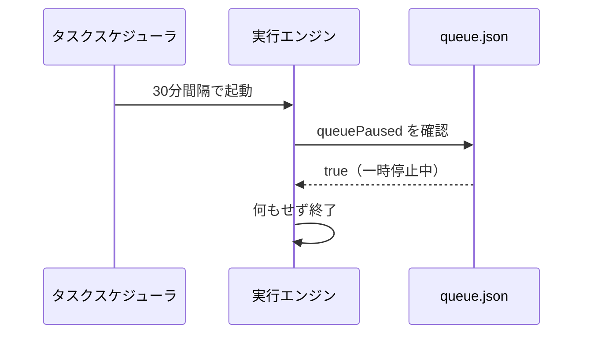
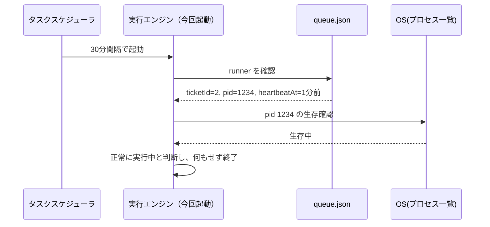
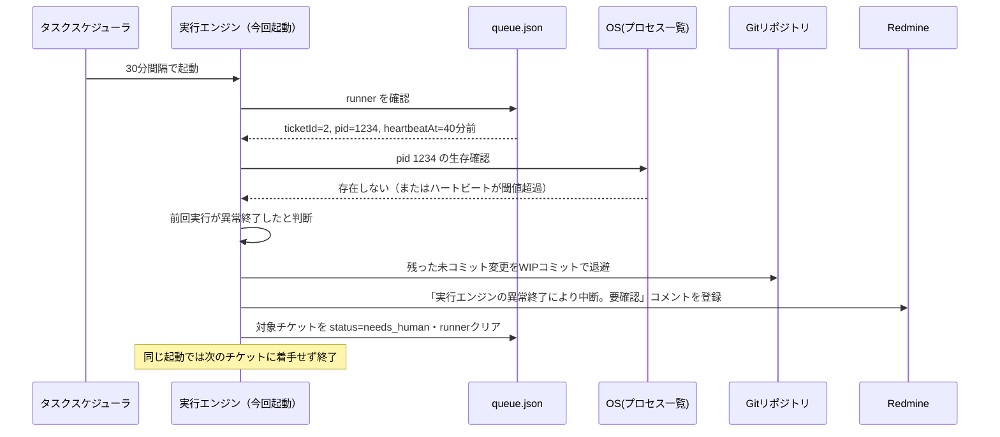

# シーケンス図

## 1. チケット登録

## 2. 正常系（実装→レビューPASS→プッシュ）

## 3. レビューNG→差し戻し再実装（上限内）

## 4. 再実装ループが上限到達

## 5. タイムアウト（Copilot CLIが応答しない）

## 6. Web画面からの強制中断（即時）

## 7. キュー一時停止中の起動

## 8. 多重起動防止（前回の処理が正常に継続中）

## 9. 異常終了からの復旧（PC再起動・プロセス強制終了など）

