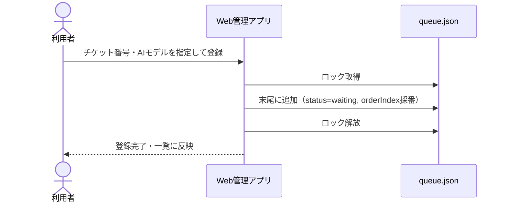
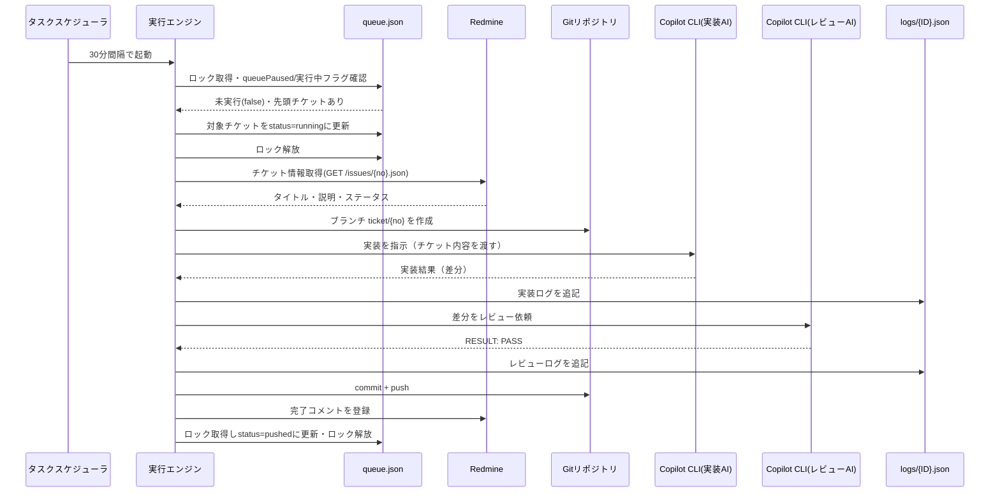
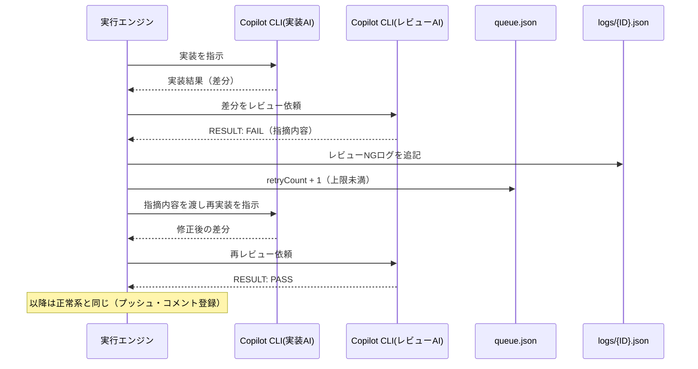
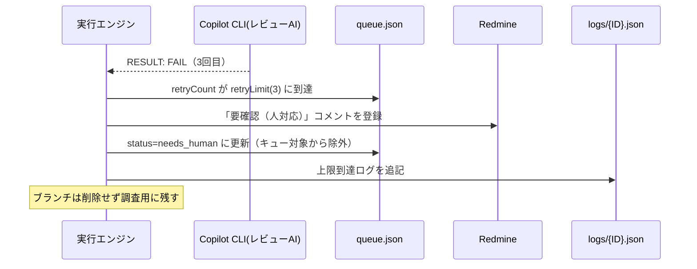
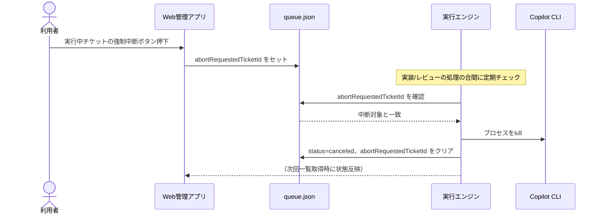
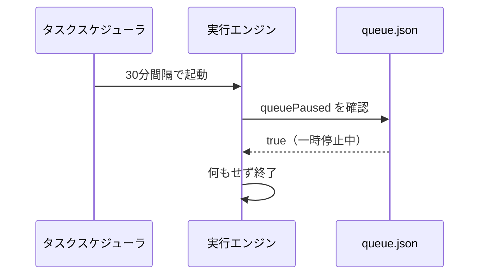
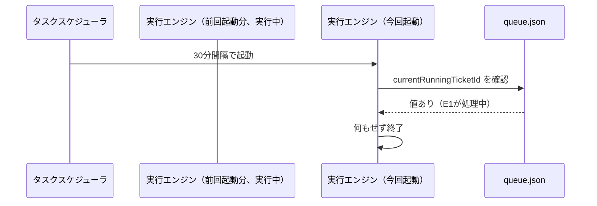

# シーケンス図

## 1. チケット登録

```mermaid
sequenceDiagram
    actor U as 利用者
    participant W as Web管理アプリ
    participant Q as queue.json

    U->>W: チケット番号・AIモデルを指定して登録
    W->>Q: ロック取得
    W->>Q: 末尾に追加（status=waiting, orderIndex採番）
    W->>Q: ロック解放
    W-->>U: 登録完了・一覧に反映
```

## 2. 正常系（実装→レビューPASS→プッシュ）

```mermaid
sequenceDiagram
    participant S as タスクスケジューラ
    participant E as 実行エンジン
    participant Q as queue.json
    participant R as Redmine
    participant G as Gitリポジトリ
    participant CI as Copilot CLI(実装AI)
    participant CR as Copilot CLI(レビューAI)
    participant L as logs/{ID}.json

    S->>E: 30分間隔で起動
    E->>Q: ロック取得・queuePaused/実行中フラグ確認
    Q-->>E: 未実行(false)・先頭チケットあり
    E->>Q: 対象チケットをstatus=runningに更新
    E->>Q: ロック解放
    E->>R: チケット情報取得(GET /issues/{no}.json)
    R-->>E: タイトル・説明・ステータス
    E->>G: ブランチ ticket/{no} を作成
    E->>CI: 実装を指示（チケット内容を渡す）
    CI-->>E: 実装結果（差分）
    E->>L: 実装ログを追記
    E->>CR: 差分をレビュー依頼
    CR-->>E: RESULT: PASS
    E->>L: レビューログを追記
    E->>G: commit + push
    E->>R: 完了コメントを登録
    E->>Q: ロック取得しstatus=pushedに更新・ロック解放
```

## 3. レビューNG→差し戻し再実装（上限内）

```mermaid
sequenceDiagram
    participant E as 実行エンジン
    participant CI as Copilot CLI(実装AI)
    participant CR as Copilot CLI(レビューAI)
    participant Q as queue.json
    participant L as logs/{ID}.json

    E->>CI: 実装を指示
    CI-->>E: 実装結果（差分）
    E->>CR: 差分をレビュー依頼
    CR-->>E: RESULT: FAIL（指摘内容）
    E->>L: レビューNGログを追記
    E->>Q: retryCount + 1（上限未満）
    E->>CI: 指摘内容を渡し再実装を指示
    CI-->>E: 修正後の差分
    E->>CR: 再レビュー依頼
    CR-->>E: RESULT: PASS
    Note over E: 以降は正常系と同じ（プッシュ・コメント登録）
```

## 4. 再実装ループが上限到達

```mermaid
sequenceDiagram
    participant E as 実行エンジン
    participant CR as Copilot CLI(レビューAI)
    participant Q as queue.json
    participant R as Redmine
    participant L as logs/{ID}.json

    CR-->>E: RESULT: FAIL（3回目）
    E->>Q: retryCount が retryLimit(3) に到達
    E->>R: 「要確認（人対応）」コメントを登録
    E->>Q: status=needs_human に更新（キュー対象から除外）
    E->>L: 上限到達ログを追記
    Note over E: ブランチは削除せず調査用に残す
```

## 5. Web画面からの強制中断

```mermaid
sequenceDiagram
    actor U as 利用者
    participant W as Web管理アプリ
    participant Q as queue.json
    participant E as 実行エンジン
    participant CI as Copilot CLI

    U->>W: 実行中チケットの強制中断ボタン押下
    W->>Q: abortRequestedTicketId をセット
    Note over E: 実装/レビューの処理の合間に定期チェック
    E->>Q: abortRequestedTicketId を確認
    Q-->>E: 中断対象と一致
    E->>CI: プロセスをkill
    E->>Q: status=canceled、abortRequestedTicketId をクリア
    E-->>W: （次回一覧取得時に状態反映）
```

## 6. キュー一時停止中の起動

```mermaid
sequenceDiagram
    participant S as タスクスケジューラ
    participant E as 実行エンジン
    participant Q as queue.json

    S->>E: 30分間隔で起動
    E->>Q: queuePaused を確認
    Q-->>E: true（一時停止中）
    E->>E: 何もせず終了
```

## 7. 実行エンジンの多重起動防止

```mermaid
sequenceDiagram
    participant S as タスクスケジューラ
    participant E1 as 実行エンジン（前回起動分、実行中）
    participant E2 as 実行エンジン（今回起動）
    participant Q as queue.json

    S->>E2: 30分間隔で起動
    E2->>Q: currentRunningTicketId を確認
    Q-->>E2: 値あり（E1が処理中）
    E2->>E2: 何もせず終了
```
